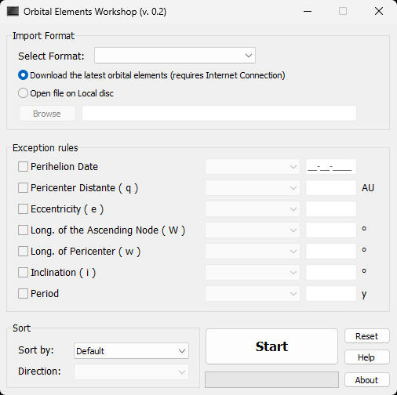

## Archive

In the beginning no actual source control system was used. Instead there were multiple copies of folders in "[*Final*](https://phdcomics.com/comics/archive.php?comicid=1531)"-like manner. There was no real versioning either. Rather some arbitrarily version assigning for the purpose of separating new projects from the old ones.  

For versions 0.1 to 0.7 (2011-2014) that "Final" *source control* was employed.  

  
(*Example*)

In April 2024 all that folder copies were migrated to git to preserve history the right way.  
Generally one folder was taken as one commit and the latest *Date Modified* of all files in that folder was taken as *commit date*.  

Version 0.8 was the only one under source control from the beginning and it was hosted in [Azure DevOps](https://azure.microsoft.com/en-us/products/devops) (at that time it was called *Visual Studio Online*). [TFVC](https://learn.microsoft.com/en-us/azure/devops/repos/tfvc/what-is-tfvc?view=azure-devops) was used as source control system and for migration to git [git-tfs](https://github.com/git-tfs/git-tfs) tool was used.  

#### Branches

Branches "01" to "08" contain history only for that specific version and now they serve only for archive purpose.  
Only master branch contains [full history](https://github.com/jurakovic/Comets/commits/master/) from the very first commit through all versions. It was made basically by rebasing one archive branch onto another (with some caveats).  

| Branch | Version | Source | Commits | Language | Tool |
|--|--|--|--|--|--|
| 01_oew_console   | 0.1          | [source](https://github.com/jurakovic/Comets/tree/archive/01_oew_console)   | [commits](https://github.com/jurakovic/Comets/commits/archive/01_oew_console)   | C, C++ | CodeBlocks, Dev-C++     |
| 02_sscgen        | 0.2          | [source](https://github.com/jurakovic/Comets/tree/archive/02_sscgen)        | [commits](https://github.com/jurakovic/Comets/commits/archive/02_sscgen)        | C++    | C++ Builder, RAD Studio |
| 03_06_cometoew   | 0.3 - 0.6    | [source](https://github.com/jurakovic/Comets/tree/archive/03_06_cometoew)   | [commits](https://github.com/jurakovic/Comets/commits/archive/03_06_cometoew)   | C++    | C++ Builder, RAD Studio |
| 07_cometoew      | 0.7          | [source](https://github.com/jurakovic/Comets/tree/archive/07_cometoew)      | [commits](https://github.com/jurakovic/Comets/commits/archive/07_cometoew)      | C#     | Visual Studio           |
| 08_comets_dev    | 0.8 (dev)    | [source](https://github.com/jurakovic/Comets/tree/archive/08_comets_dev)    | [commits](https://github.com/jurakovic/Comets/commits/archive/08_comets_dev)    | C#     | Visual Studio           |
| 08_comets_master | 0.8 (master) | [source](https://github.com/jurakovic/Comets/tree/archive/08_comets_master) | [commits](https://github.com/jurakovic/Comets/commits/archive/08_comets_master) | C#     | Visual Studio           |

#### Screenshots

  
(*v0.1*)

  
(*v0.2*)

  
(*v0.3*)

  
(*v0.4*)

  
(*v0.6*)

  
(*v0.7*)

#### Tools

List of tools that can be used to open (and build) specific version project (or solution):

CodeBlocks  
https://www.codeblocks.org/  

Dev-C++  
https://www.bloodshed.net/  

Embarcadero Dev-C++  
https://www.embarcadero.com/free-tools/dev-cpp  
https://github.com/Embarcadero/Dev-Cpp  

Embarcadero C++ Builder  
https://www.embarcadero.com/products/cbuilder/starter  

Embarcadero RAD Studio (Trial)  
https://www.embarcadero.com/products/rad-studio  

Visual Studio  
https://visualstudio.microsoft.com/vs/community/  
